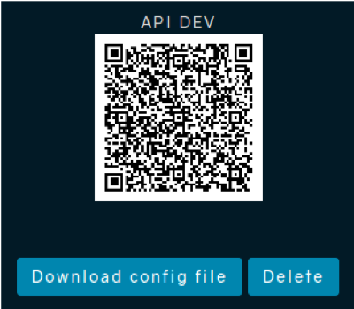

# PikcioChain API

This is the Open Source Python SDK of the PikcioChain.

This documentation will get you through setting up the API and contains 
an index of its endpoints, along with examples.

If you have trouble using the API, send us an email at [support@pikcio.com](mailto:support@pikcio.com)

## Revisions

Current revisiion is 2.0.5 - Aug 2018

**Name**|**Date**|**Version #**|**Comments**
:-----:|:-----:|:-----:|:-----:
Hugo ROCHE|May 2016|1.09|Creation
Hugo ROCHE|July 2016|1.12|Config file and improve documentation
Hugo ROCHE|July 2016|1.12|Add file functions
Fabien BUCAMP|March 2017|2.02|Improve configuration file, test all existing requests following the Pikcio code refactoring and update documentation
Fabien BUCAMP|July 2017|2.03|Add PikcioChain features: certified chat, file, check certification for chat, file and Pikcio message. Refactor init
Fabien BUCAMP|September 2017|2.04|Add wallet features: pay, update transactions, get transactions
Aurélien LAWICKI|August 2018|2.05|Update API features and tests

## Setup

### Download package

Once you've downloaded the Python SDK package, you'll find multiple compiled python files: 
- *safe2client_api.pyc*
- *log.pyc*
- *pattern.pyc* 
- *config.pyc*
- *run.pyc*

You will find also two files that you will have to edit to use this SDK:
- *global.cfg*
- *tests.py*

### Create API client in Pikcio

Log in Pikcio, go to **Settings** and select **Pikcio API**.

In this UI you can create a new available connexion to the API embedded in Pikcio.
Select **Authorization Code** if you want to access the API from a webserver 
(connexion will be signed with your url) or select **Password** to connect the 
API without having a webserver (mobile application for example).

Put a name to your new connexion and a scope.

**Client Address** and **port** are only useful for **Authorization Code** method. Put the URL or IP address of your webserver and the port number.
The authorization process will be redirected to your server at the url `/api/authorized`


When you validate your data, a new connection is created and a QR code is displayed on the screen.
You will be able to flash this code to retrieve credentials to connect the API (Client ID and secret, IP address and port, …) or you can download a config file that contains this information too.



The configuration file downloaded (see next section) can be used as it is in the API client.
You can modify it if needed. The whole network configuration can be checked in the network section of the settings popup in Pikcio.

### Configuration

`global.cfg` is the configuration file that contains all information to run this SDK.

You have to update this configuration file with your information, according to Pikcio API client (see previous section) and to your application (webserver for example).

Here's a list of the values that are in the config file and their meaning:

**Section**|**Value**|**Description**
:-----:|:-----:|:-----:
[application]|name|Name of your application
[application]|port|WebServer port number of your application
[log]|level|Level of log you want from this SDK (1: only critical, 5: all)
[log]|directory|Directory of the log files
[log]|file|Name of the log file
[log]|life_time|Number of days before a daily log file will be deleted
[server]|public_ip|Public IP address of the Pikcio API
[server]|private_ip|Private IP address of the Pikcio API
[server]|public_port|Public port number of the Pikcio API
[server]|private_port|Private port number of the Pikcio API
[server]|tls|Secured API (https) ? True or False
[api_client]|client_id|Client ID of the API connection you created
[api_client]|client_secret|Client secret of the API connection you created
[api_client]|auth_type|OAuth2 authentication method : password_header, password_data or grant_code
[api_client]|redirect_uri|Your redirect URI
[api_client]|scope|Scope name of the API connection

Example:
```buildoutcfg
[application]
name = PySafe2Net
port = 9055

[log]
level = 3
directory = log
file = pikciochain.log
life_time = 30

[server]
public_ip = 123.123.123.123
private_ip = 192.168.1.10
public_port = 9000
private_port = 9000
tls = False

[api_client]
client_id = J3lQgfbFMiWCCWJfSweQulOzyz3whZGYNM2hgX3l
client_secret = n3Kg2u4iPcRzxXKChciNfT2nT9eGX9lLdFyncFSVcYuAthHHCM
auth_type = password_header
redirect_uri = https://my_pikcio_app.com/api/authorized
scope = api
```

### Connection
Import the ClientAPI class from PikcioChain, create an instance of the class and start programming!

To use the logger: import logger (`from log import Logger`) and then just 
create an instance of the Logger class (no parameters needed). You can now call 
functions like: debug, warning etc… that will create / update the log file in
the path you specified in the config file.

The files `run.pyc` and `tests.py` are here to help you to test the API connection.
First, you have to update `tests.py` with your credentials and your requests.
Then you just have to run `run.pyc` to execute your code.

You can use these files to connect and interact with the PikcioChain API or 
create your own files to use the SDK.

_Example_:
```python
# declare an instance of ClientAPI
username = "Pikcio_username"
password_hash = hashlib.sha1("your_password").digest().encode('hex')
client_api = ClientAPI(username=username, password=password_hash)
# Make connexion to API and get tokens
access = client_api.get_access_token()
```

The SDK will try to access the PikcioChain API described in the configuration 
file. First it will test the public IP address and port, then, if it does not 
work, it will connect the private configuration.

If you want to access PikcioChain API only via private IP (for development 
purpose for example), you can specify private IP and port in both private and 
public fields of the configuration file.

You will get the following answer:
```json
{
  "status": true,
  "msg": "API access granted",
}
```
If one of the given credentials is wrong or if the PikcioChain API is unreachable, 
the library will return this error message:
```json
{
  "status": false, 
  "msg": "API authentication failed",
}
```

## API requests documentation
All the requests are sent to PikcioChain API by calling the functions of the ClientAPI library.
All the data are sent or received in JSON format.

If you are requesting a wrong url, you will get the following message:
```json
{
  "errors": [
    {
      "message": "The requested URL was not found on the server. If you entered the URL manually please check your spelling and try again.",
      "code": 404,
    }
  ]
}
```

### User management
In this section, you will find all the available requests to manage profile and data of the registered user.

#### Change user password

```python
json_update_password = {
    "current_password": "old_password",
    "password": "new_password",
    "retype_password": "new_password"
}
result = client_api.update_password(json_update_password)
```

##### Response for correct request
```json
{
  "msg": "Password successfully updated!",
  "status": true
}
```

##### If current password is not correct
```json
{
  "msg": "Invalid Current Password",
  "status": false
}
```

##### If password and retype password don't match
```json
{
  "msg": "Password and retype Password don't match",
  "status": false
}
```

#### Get user avatar

```python
result = client_api.get_user_avatar()
```

##### Response for correct request
```json
{
  "avatar": {
    "data": "BASE54 IMG DATA",
    "extension": "png",
    "name": "file_name.png",
    "path": "my_files/file_name.png"
  },
  "status": true
}
```

#### Set user avatar
This function updates the avatar file of the registered user. Allowed file 
types are `PNG`, `JPG`, `JPEG` and `GIF`.

```python
json_set_user_avatar = {
    "avatar":
        {
            "data": BASE64 IMG DATA,
            "value": "file_name.jpg"
        }
}
result = client_api.set_user_avatar(json_set_user_avatar)
```

##### Response for correct request
```json
{
  "msg": "Avatar updated",
  "status": true
}	# wrong file name
```

##### Possible responses for wrong requests
```json
{
  "msg": "Invalid avatar file type",
  "status": false
}
```
```json
// bad file data
{
  "msg": "Saving profile image failed",
  "status": false
}
```

#### Get user profile
This function retrieves all the profile of the registered user.

```python
result = client_api.get_user_profile()
```

Response for correct request includes all the default profile items from Pikcio and custom profile item created by the user, according to the following format:
```json
{
  "profile": {
    "item_name": {
      "order": 40,                  // used by the UI
      "shared": 1,                  // Item shared with contacts (1) or not (0)
      "tag": "account",             // used by the UI
      "type": "text",               // data type of the value
      "value": "my_files/file.png"  // content / information of the item
    }
  },
  "status": true
}
```
Here is an extract of a response:
```json
{
  "profile": {
    "avatar": {
      "order": 40,
      "shared": 1,
      "tag": "account",
      "type": "text",
      "value": "my_files/file_name.png"
    },
    "country": {
      "order": 30,
      "shared": 1,
      "tag": "living",
      "type": "text",
      "value": "France"
    },
    "email": {
      "order": 50,
      "shared": 1,
      "tag": "account",
      "type": "text",
      "value": "dev@matchupbox.com"
    }
  },
  "status": true
}
```

#### Update user profile

```python
json_update_user_profile = {
    "profile":
        {
            "country": {'value': 'France', 'shared': False}
        }
}
result = client_api.update_user_profile(json_update_user_profile)
```

You can specify here which parameter you want to update (in the example, 
we want to change our country) and for each parameter you have to give the 
new value and if you want the information to be shared or not.

You can add as many items as you want to update in one request:

```python
json_update_user_profile = {
    "profile":
        {
            "children": {'value': '2', 'shared': False},
            "country": {'value': 'France', 'shared': True}
        }
}
```

Only `'value'` and `'shared'` can be updated for each item.

If the item is already known by the database, value and shared will be updated.
If the item does not exist, it will be created as a custom field.

All items have been updated except items that have been returned in `err` list.

##### Correct POST request will result of a true status
```json
{
  "err": [],
  "msg": "Profile updated",
  "status": true
}
```
##### Some result examples for wrong requests
```json
{
  "err": [
    {
      "birth_date": "Wrong date format"
    },
    {
      "children": "Wrong number format"
    }
  ],
  "msg": "Profile updated",
  "status": true
}
```
```json
{
  "err": [
    {
      "children": "Number of children must be positive"
    }
  ],
  "msg": "Profile updated",
  "status": true
}
```

#### Delete custom item from user profile

```python
json_delete_custom_profile_item = {
  "item": "user item name"
}
result = client_api.delete_custom_profile_item(json_delete_custom_profile_item)
```

##### Response for correct answer
```json
{
  "msg": "Item successfully deleted",
  "status": true
}
```
##### If the item does not exist in database
```json
{
  "msg": "This item does not exist",
  "status": false
}
```

### Contact Management

#### Find user
To find a user on the network, you have to call the following function :

```python
result = client_api.find_user(query='your query')
```

The query could be a username, an email address, … It could be one of the 
shared item of the profile of the user you want to find.

For example, if you want to find a user who lives in Paris, you can fill in the
query with 'Paris'. The network will return all the users who shared Paris in 
their profile.

##### Example of a JSON response
```json
{
  "data": [
    {
      "avatar": "BASE64 IMG DATA",
      "entrypoints": [
        "2c4a30797ffba281c1e99371d27d3c92ca7b5d59"
      ],
      "matr_id": "41f91225e521b2bb03f7680f26a8b366cb134c3e",  // matryoshka ID of the user
      "replicant": [],                                        // list of replicants' matryoshka
      "username": "florian"                                   // ID of the user
    }
  ],
  "status": true
}
```

##### If the query does not match with any user on the network
```json
{
  "msg": "No match found",
  "status": true
}
```

#### Add user as a contact
You can add a user to your contacts list by sending him a contact request. 
This request is following the find user request and need some information from 
the response of `find_user`.

```python
json_add_contact = {
    "matr_id": "41f91225e521b2bb03f7680f26a8b366cb134c3e",
    "username": "florian"
}
result = client_api.add_contact(json_add_contact)
```

##### Response for correct request
```json
{
  "msg": "Contact request sent",
  "status": true
}
```

##### If already in your contacts list
```json
{
  "msg": "Contact already added",
  "status": false
}
```

#### Get contacts
This function retrieves the contacts list of the current user with some 
parameters.

```python
result = client_api.get_contacts()
```

##### JSON response for correct request
```json
{
  "msg": "Contacts successfully retrieved",
  "data": [
    {
      "is_backup": true,
      "is_backuper": false,
      "is_favorite": "true",
      "is_replicant": "true",
      "is_substitute": 0,
      "is_vouched": "false",
      "matryoshka_id": "41bcb4ec2ceb21cb47a55fcda519168efdcd5555",
      "pending": false,
      "persona_id": "e186f3bea09ec503593b87ef4467d9d0322fbabe",
      "request": false,
      "role": "TRUSTEE",
      "tci": 35,
      "trust_id": 242,
      "trust_status": "FRIEND",
      "username": "fabien"
    },
    {
      "is_backup": false,
      "is_backuper": true,
      "is_favorite": "false",
      "is_replicant": "false",
      "is_substitute": 0,
      "is_vouched": "false",
      "matryoshka_id": "e6dee48dd7a5264a2bb4ed0f9758c0befa33f337",
      "pending": false,
      "persona_id": "d4b3c93e14c308414ffd7b06e896059bfa595045",
      "request": false,
      "role": "TRUSTER",
      "tci": 35,
      "trust_id": 248,
      "trust_status": "FRIEND",
      "username": "florian"
    }
  ],
  "status": true
}
```

#### Get contact profile
This function retrieve all the shared profile items of the given contact 
(by his matryoshka ID).

```python
result = client_api.get_contact_profile(matr_id='6ba95e36a2a4ff913fc6070f9a870ac0a8af2907')
```

##### The response could contain all the shared item of the contact's profile
```json
{
  "data": {
    "avatar": "BASE64 IMG DATA",
    "avatar_extension": "png",
    "birth_date": "11/11/1980",
    "birth_place": "Paris",
    "children": "0",
    "city": "Paris",
    "company": "Matchupbox",
    "country": "France",
    "facebook_connections": "0",
    "facebook_name": "MUB",
    "favorite team": "",
    "google_connections": "100",
    "google_name": "MUB",
    "job_title": "Safe2Net",
    "last_logged_date": "2016-11-08 16:27:57",
    "linkedin_connections": "100",
    "linkedin_name": "MUB",
    "nationality": "French",
    "occupation": "manager",
    "persona_id": "6ba95e36a2a4ff913fc6070f9a870ac0a8af2907",
    "quote": "Everything decentralized",
    "tci": 42,
    "username": "mub"
  },
  "status": true
}
```

##### If the persona ID is invalid
```json
{
  "msg": "Contact not found",
  "status": false
}
```

#### Remove contact
```python
json_remove_contact = {
    "matr_id": "41f91225e521b2bb03f7680f26a8b366cb134c3e",
    "keep_files": True
}
result = client_api.remove_contact(json_remove_contact)
```

Arguments:
- *matr_id*: the matryoshka id of the pikcio user you want to remove
- *keep_files*: boolean used to specify if you want to keep (`True`) or delete (`False`) all data exchanged with this user

##### JSON response for correct request
```json
{
  "msg": "Contact successfully removed",
  "status": true
}
```
##### Possible response for wrong requests
```json
// matr_id does not exist in database, the user is not in your contacts list
{
  "msg": "This contact is not in DB",
  "status": false
}
```
```json
// wrong value for keep_files
{
  "msg": "keep_files is not defined",
  "status": false
}
```
```json
// if this contact is blocking you
{
  "msg": "Cannot remove a contact while being blocked",
  "status": false
}
```

#### Accept friend request
```python
result = client_api.accept_contact_request(matr_id="1d2b1f829a68b7b41a30b3ab6165a34b6b2a952c")
```

##### JSON response for correct request
```json
{
  "msg": "Friend request accepted",
  "status": true
}
```
##### Possible response for wrong requests
```json
{
  "msg": "This user has not sent you a contact request",
  "status": false
}
```

#### Reject friend request

```python
result = client_api.reject_contact_request(matr_id="1d2b1f829a68b7b41a30b3ab6165a34b6b2a952c")
```

#### JSON response for correct request
```json
{
  "msg": "Friend request rejected",
  "status": true
}
```

#### Possible response for wrong request
```json
{
  "msg": "This user has not sent you a contact request",
  "status": false
}
```

### Chat messages

#### Get chat conversation
This function returns the list of chat messages exchanged with a given contact.

```python
json_get_conversation = {
    "chat": {
        "matr_id": '1a3dc918c938a22ab4b3d8ab7d9fae55cdb2b8cb',
        "date": '2017-01-01 16:07:53',
        "filter": "after",
	 "limit": 10
    }
}
result = client_api.get_chat_conversation(json_get_conversation)
```

Arguments:
- *matr_id*: can either be yours or one of your friends'. You'll get all the messages sent/received by/from this matr_id.
- *date* [optional]: allows you to filter the messages by date.
- *filter* [optional]: allows you to specify if you want to get messages older ('before') or younger ('after') than the given date.
- *limit* [optional] : allows you to specify the maximum number of messages you want to retrieve (100 by default)

##### JSON response for correct request
```json
{
  "data": [
    {
      "message": "qsdfghjklm",
      "message_id": "a74d1ab7873be4e86398e8cd421f13744d8478ed",
      "received_date": "2017-01-12 15:50:26.869855+01:00",
      "receiver_matr_id": "1a3dc918c938a22ab4b3d8ab7d9fae55cdb2b8cb",
      "sender_matr_id": "d3ae1f68a67e30b9531e11ea33f4a8b12d41fc6f",
      "sent_date": "2017-01-12 15:47:40.290754+01:00",
      "status": "RECEIVED",
      "is_read": 0,
    },
    {
      "message": "Ola!",
      "message_id": "36b21d376d4fe2e0ad041c882c0347f4e8c08f83",
      "received_date": "2017-01-12 15:50:26.088795+01:00",
      "receiver_matr_id": "1a3dc918c938a22ab4b3d8ab7d9fae55cdb2b8cb",
      "sender_matr_id": "d3ae1f68a67e30b9531e11ea33f4a8b12d41fc6f",
      "sent_date": "2017-01-12 15:34:05.482822+01:00",
      "status": "RECEIVED",
      "is_read": 1,
    }
  ]
}
```
##### Possible response for wrong request
```json
// matr_id is the matr_id of the connected user
{
  "msg": "You cannot send your matr_id",
  "status": false
}
```
```json
// matr_id is malformed or does not match with a contact
{
  "msg": "Unknown contact",
  "status": false
}
```
```json
// filter value is not authorized
{
  "msg": "Unauthorized filter value",
  "status": false
}
```
```json
// date format issue
{
  "msg": "Invalid date format",
  "status": false
}
```
```json
// limit value is not authorized must be positive
{
  "msg": "Invalid limit value",
  "status": false
}
```

#### Send chat message

```python
json_send_chat_message = {
  "receivers": [
    {
      'matr_id': 'd1ce7862a31fc8499c50146da65f85f507fdb013'
    },
    {
      'matr_id': '1a3dc918c938a22ab4b3d8ab7d9fae55cdb2b8cb'
    }
  ],
  "message": "Test from API, certified message",
  "certify": True
}
result = client_api.send_chat_message(json_send_chat_message)
```

`data` contains sent messages. If a receiver's `matr_id` is not in that list, 
it's because it is not a correct `matr_id` (not a friend, malformed, …).

#### JSON response for correct request
```json
{
  "data": [
    {
      "datetime": "2017-03-02 17:09:51.245497+00:00",
      "matr_id": "d1ce7862a31fc8499c50146da65f85f507fdb013",
      "msg_id": "459b5e9cd4e84c292a348558d1946480c243ea9b"
    }
  ],
  "msg": "Message successfully sent",
  "status": true
}
```

#### Possible response for wrong request

```json
// receivers are incorrect (malformed matr_id)
{
  "errors": null,
  "msg": "Unknown receiver(s)",
  "nb_error": 2,
  "status": false
}
```
```json
// message too long
{
  "errors": null,
  "msg": "Your message must not contain more than 150 characters",
  "nb_error": null,
  "status": false
}
```

#### Delete chat message

```python
client_api.delete_chat_message(msg_id='2f1ab896e0847ef2de42a5901eb1b542b7046032')
```

#### JSON response for correct request
```json
{
  "msg": "Message successfully deleted",
  "status": true
}
```
#### Possible response for wrong request
```json
// message ID not found in database
{
  "msg": "Message not found",
  "status": false
}
```
```json
// message ID malformed
{
  "msg": "Invalid message id",
  "status": false
}
```

### File messages

#### Get file messages

```python
json_get_file_messages = {
  "file":
  {
    "matr_id": 'd3ae1f68a67e30b9531e11ea33f4a8b12d41fc6f',
    "date": '2016-04-18 09:06:16',
    "filter": "after",
    "limit": 10
  }
}
result = client_api.get_file_messages(json_get_file_messages)
```

Arguments:
- *matr_id*: can either be yours or one of your friends'. You'll get all the 
messages sent/received by/from this matr_id.
- *date* [optional]: allows you to filter the messages by date.
- *filter* [optional] : allows you to specify if you want to get messages 
older ('before') or younger ('after') than the given date.
- *limit* [optional] : allows you to specify the maximum number of messages 
you want to retrieve (100 by default)

##### JSON response for correct request
```json
{
  "data": [
    {
      "file_content": "BASE 64 FILE DATA",
      "filename": "file1.jpg",
      "message_id": "7b75ce678d09293fb54c6ffbc396fafefccc7ed2",
      "received_date": "2017-01-12 11:01:21.598943+01:00",
      "receiver_matr_id": "d3ae1f68a67e30b9531e11ea33f4a8b12d41fc6f",
      "sender_matr_id": "1a3dc918c938a22ab4b3d8ab7d9fae55cdb2b8cb",
      "sent_date": "2017-01-12 11:01:21.598871+01:00",
      "status": "SENT",
      "is_read": 1,
      "is_certified": false
    },
    {
      "file_content": "BASE 64 FILE DATA",
      "filename": "file2.pdf",
      "message_id": "7b75ce678d09293fb54c6ffbc396fafefccc7ed2",
      "received_date": "2017-02-19 13:28:52.988871+01:00",
      "receiver_matr_id": "d3ae1f68a67e30b9531e11ea33f4a8b12d41fc6f",
      "sender_matr_id": "1a3dc918c938a22ab4b3d8ab7d9fae55cdb2b8cb",
      "sent_date": "2017-02-19 21:31:21.598123+01:00",
      "status": "SENT",
      "is_read": 0,
      "is_certified": true
    }
  ],
  "msg": "File message(s) successfully retrieved",
  "status": true
}
```
##### Possible response for wrong request
```json
// matr_id is the matr_id of the connected user
{
  "msg": "You cannot send your matr_id",
  "status": false
}
```
```json
// matr_id is malformed or does not match with a contact
{
  "msg": "Unknown contact",
  "status": false
}
```
```json
// filter value is not authorized
{
  "msg": "Unauthorized filter value",
  "status": false
}
```
```json
// date format issue
{
  "msg": "Invalid date format",
  "status": false
}
```
```json
// limit value is not authorized must be positive
{
  "msg": "Invalid limit value",
  "status": false
}
```
```json
// Issue while loading the file from hdd
{
  "msg": "Failed to load the file",
  "status": false
}
```

#### Send file message
```python
try:
    with open('/home/mub/Images/blockchain1.png', 'rb') as img_file:
        file_data = base64.b64encode(img_file.read())
except (IOError, TypeError):
    file_data = ''
json_send_file_message = {
  "receivers": [
    {
      'matr_id': 'd3ae1f68a67e30b9531e11ea33f4a8b12d41fc6f'
    },
    {
      'matr_id': 'd1ce7862a31fc8499c50146da65f85f507fdb013'
    }
  ],
  "file_name": 'testingAPI.png',
  "file_content": file_data,
  "certify": True
}
result = client_api.send_file_message(json_send_file_message)
```

Arguments:
- *file_content* is the data encoded in base64.
- *file_name* contains the name and the extension of the file to send
- *receivers* is a list of the matryoshka ID of the contacts to send the file
- *certify* allows to specify if the file message has to be sent with certification

If one of the `matr_id` of receivers is not in the data, the file was not 
sent to this one (`matr_id` malformed or not in contacts list).

##### JSON response for correct request
```json
{
  "data": [
    {
      "datetime": "2017-03-08 08:32:28.593915+00:00",
      "matr_id": "d3ae1f68a67e30b9531e11ea33f4a8b12d41fc6f",
      "msg_id": "e1def892a0031d2da2aa1f21797facefa1a14ed2",
      "path_physic": "my_files/testingAPI(7).png"
    }
  ],
  "msg": "The file was successfully sent",
  "status": true
}
```
##### Possible response for wrong request
```json
// file data is corrupted
{
  "errors": null,
  "msg": "Incorrect padding.",
  "nb_errors": 1,
  "status": false
}
```
```json
// all receivers are incorrect
{
  "errors": [
    "d3ae1f68a67e30b9531e11ea33f4a8b12d41fc6",
    "d1ce7862a31fc8499c50146da65f85f507fdb01"
  ],
  "msg": "Unknown receiver(s)",
  "nb_errors": 2,
  "status": false
}
```

#### Delete file message

```python
result = client_api.delete_file_message(msg_id='e50549553b5c7740a2fe5eb359c452642410abc8')
```

##### JSON response for correct request
```json
{
  "msg": "File message(s) successfully deleted",
  "status": true
}
```

##### Possible response for wrong request
```json
// msg_id malformed
{
  "msg": "Invalid message id",
  "status": false
}
```
```json
// msg_id not found
{
  "data": [ "e50549553b5c7740a2fe5eb359c452642410abc8"
  ],
  "msg": "Some messages have not been deleted",
  "status": false
}
```
